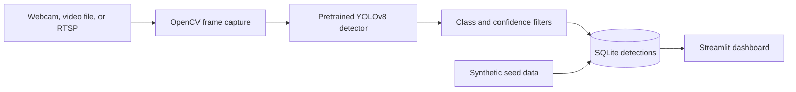

# VisionSentinel

VisionSentinel is a local computer-vision prototype that detects selected objects in video, records detections, and displays the recorded data in a Streamlit dashboard.

## Problem and solution

Video streams can contain activity that is difficult to review manually. This project demonstrates a simple pipeline from video capture to object detection, local persistence, and basic time-series analysis.

## Implemented features

- Read frames from a webcam, video file, or RTSP URL through OpenCV.
- Run the pretrained YOLOv8 model and retain detections for the configured target classes and confidence threshold.
- Record class, confidence, bounding-box coordinates, and timestamp in SQLite.
- Display counts and charts from the database in a Streamlit dashboard, with date, class, and confidence filters.
- Generate synthetic detection records for a dashboard-only demo.
- Package the dashboard in Docker Compose and include database-focused pytest tests.

The seed script creates synthetic records; those records are not outputs from the detector.

## Architecture



The capture loop is in `main.py`; inference and persistence are separated into `src/detector.py` and `src/database.py`. `dashboard/app.py` reads the same SQLite database.

## Requirements and installation

Use Python 3.11 and pip:

```bash
git clone https://github.com/Kaique-ML/vision-sentinel.git
cd vision-sentinel
python -m venv .venv

# Windows PowerShell
.venv\Scripts\Activate.ps1

# macOS/Linux
# source .venv/bin/activate

python -m pip install --upgrade pip
pip install -r requirements.txt
```

The YOLO weights may be downloaded by Ultralytics the first time the detector starts. A camera, video file, or reachable RTSP stream is needed to demonstrate live detection.

## Run a dashboard demo

This path needs no camera and gives the dashboard sample data to display:

```bash
python seed_data.py --days 7 --records 1000
streamlit run dashboard/app.py
```

Open `http://localhost:8501`.

To process a video source and save an annotated output:

```bash
python main.py --source path/to/video.mp4 --save-video output.mp4
```

For a webcam, use `--source 0`. The requirements currently use a headless OpenCV package, so the optional `--show` window requires a GUI-capable OpenCV installation.

## Tests

```bash
pytest tests/ -v
```

The current tests cover SQLite initialization and writes; they do not test detector accuracy, camera capture, or dashboard behavior.

## Limitations and future work

**Current limitations**

- The project uses pretrained YOLOv8 weights and a fixed set of target classes; it does not include a custom-trained model or model-quality evaluation.
- SQLite and the dashboard are local/demo components. There is no user authentication, alert delivery, external API, or multi-user data service.
- Seeded records are synthetic and must not be confused with camera-derived observations.
- The repository does not currently include a `LICENSE` file, despite the license badge in the previous README.

**Possible future work (not implemented):** add a recorded demo, test inference with representative footage, document resource requirements, and add authenticated alert or API integrations where needed.
